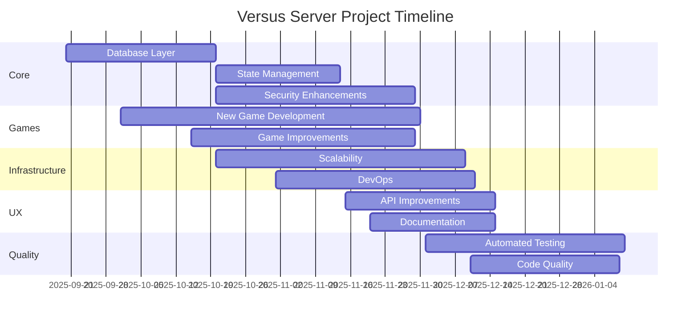

# Versus Server Project Plan

## Phase 1: Core Framework Improvements
1. **Enhance Database Layer**
   - Add support for PostgreSQL
   - Implement connection pooling
   - Add migration system

2. **Improve Game State Management**
   - Add versioning for game states
   - Implement state compression
   - Add state validation middleware

3. **Security Enhancements**
   - Add input sanitization
   - Implement rate limiting
   - Add audit logging

## Phase 2: Game Implementations
1. **New Game Development**
   - Implement basic rules engine
   - Add 5 new games (Scrabble, Backgammon, Uno, etc.)
   - Create game templates for faster development

2. **Existing Game Improvements**
   - Add AI opponents for all games
   - Implement game-specific analytics
   - Add tutorial modes

## Phase 3: Infrastructure
1. **Scalability**
   - Implement horizontal scaling
   - Add load testing
   - Set up monitoring

2. **DevOps**
   - Create CI/CD pipeline
   - Add containerization support
   - Implement blue/green deployment

## Phase 4: User Experience
1. **API Improvements**
   - Add GraphQL support
   - Implement real-time updates
   - Add webhook support

2. **Documentation**
   - Create API reference
   - Add game rules documentation
   - Create developer guides

## Phase 5: Testing & Quality
1. **Automated Testing**
   - Add end-to-end tests
   - Implement property-based testing
   - Add performance tests

2. **Code Quality**
   - Implement static analysis
   - Add code coverage tracking
   - Set up code review process

## Timeline

## Resources
- **Team**: 5 developers, 2 QA engineers, 1 DevOps
- **Budget**: $500,000
- **Timeline**: 6 months

## Risks & Mitigation
1. **Risk**: Scope creep
   **Mitigation**: Strict feature freeze after initial planning

2. **Risk**: Performance issues
   **Mitigation**: Early load testing and monitoring

3. **Risk**: Security vulnerabilities
   **Mitigation**: Regular security audits and penetration testing