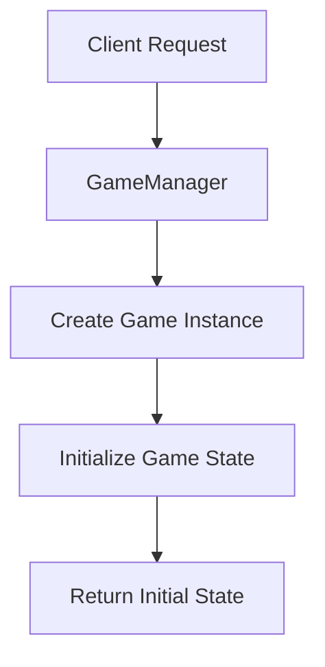
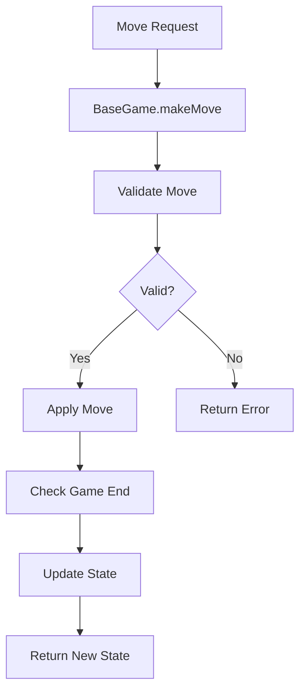
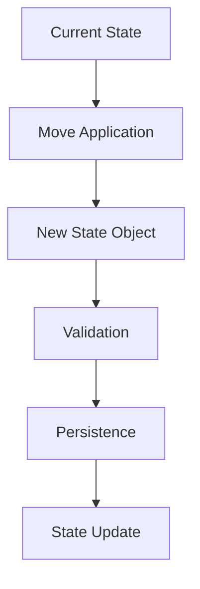

# Versus Game Server Architecture

## Overview

The Versus Game Server is a TypeScript-based game engine designed for turn-based multiplayer games. It provides a robust, extensible framework for implementing various game types with consistent APIs and comprehensive validation.

## Core Architecture Principles

### 1. **Modular Design**

- Each game is a self-contained module
- Shared utilities and patterns in reusable components
- Clear separation between game logic and infrastructure

### 2. **Type Safety**

- Comprehensive TypeScript interfaces
- Runtime validation for external inputs
- Generic types for reusable patterns

### 3. **Immutable State**

- Game states are immutable objects
- State changes through pure functions
- Predictable state transitions

### 4. **Extensibility**

- Abstract base classes for common patterns
- Mixin system for shared behaviors
- Plugin architecture for new features

## System Components

### Core Layer (`src/core/`)

#### BaseGame (`base-game.ts`)

Abstract base class that all games must extend:

```typescript
abstract class BaseGame {
  // Required implementations
  abstract initializeGame(config?: GameConfig): Promise<GameState>;
  abstract validateMove(moveData: Record<string, any>): Promise<MoveValidationResult>;
  abstract getGameState(): Promise<GameState>;
  abstract isGameOver(): Promise<boolean>;
  abstract getWinner(): Promise<string | null>;
  abstract getMetadata(): GameMetadata;

  // Protected methods for subclasses
  protected abstract applyMove(move: GameMove): Promise<void>;
  protected abstract persistState(): Promise<void>;
  protected abstract loadState(): Promise<void>;
}
```

#### GameManager (`game-manager.ts`)

Manages game lifecycle and coordination:

- Game creation and initialization
- Player management
- Game state persistence
- Event handling and notifications

#### StatsService (`stats-service.ts`)

Handles game statistics and analytics:

- Move tracking and analysis
- Performance metrics
- Player statistics
- Game outcome recording

### Game Layer (`src/games/`)

Individual game implementations that extend BaseGame:

```
games/
├── battleship.ts      # Naval strategy game
├── blackjack.ts       # Card game with betting
├── checkers.ts        # Classic board game
├── chess.ts           # Strategic board game
├── connect-four.ts    # Drop-token game
├── poker.ts           # Texas Hold'em poker
├── tic-tac-toe.ts     # Simple grid game
└── [new-games].ts     # Future additions
```

Each game follows the same pattern:

1. **State Definition**: TypeScript interfaces for game state
2. **Move Validation**: Comprehensive rule checking
3. **State Transitions**: Pure functions for state updates
4. **Win Detection**: Game-specific victory conditions

### Type System (`src/types/`)

#### Core Types (`game.ts`)

Fundamental interfaces used across all games:

```typescript
interface GameState {
  gameId: string;
  gameType: string;
  gameOver: boolean;
  winner: string | null;
  currentPlayer: string;
}

interface GameMove {
  player: string;
  moveData: Record<string, any>;
  timestamp: number;
}

interface MoveValidationResult {
  valid: boolean;
  error?: string;
}
```

#### Enhanced Types (`game-types.ts`)

Advanced type definitions for complex scenarios:

- Generic game state patterns
- Validation schemas and builders
- Error handling types
- Utility types for type inference

### Utility Layer (`src/utils/`)

#### Game Utils (`game-utils.ts`)

Common game mechanics:

- Player turn management
- Board/grid utilities
- Position validation
- Random number generation

#### Card Utils (`card-utils.ts`)

Card game specific utilities:

- Deck creation and shuffling
- Hand evaluation
- Card sorting and comparison
- Standard card game patterns

#### Validation Helpers (`validation-helpers.ts`)

Reusable validation functions:

- Input sanitization
- Format validation
- Business rule checking
- Error message generation

#### Game Templates (`game-templates.ts`)

Mixins and templates for common game patterns:

- BoardGameMixin for grid-based games
- CardGameMixin for deck-based games
- TurnBasedMixin for sequential gameplay

### Test Layer (`tests/`)

Comprehensive test suites for each game:

```
tests/
├── [game-name].test.ts    # Individual game tests
├── helpers/
│   └── gameTestHelpers.ts # Shared testing utilities
└── setup.ts               # Test configuration
```

Test structure follows consistent patterns:

- **Game Initialization**: Setup and metadata validation
- **Move Validation**: All validation scenarios
- **Game Mechanics**: Core gameplay logic
- **Win Conditions**: End game scenarios
- **Error Handling**: Edge cases and error recovery

## Data Flow

### 1. Game Initialization



### 2. Move Processing



### 3. State Management



## Design Patterns

### 1. **Template Method Pattern**

BaseGame defines the algorithm structure, subclasses implement specific steps:

```typescript
// BaseGame template method
async makeMove(moveData: Record<string, any>): Promise<GameState> {
  const validation = await this.validateMove(moveData);  // Implemented by subclass
  if (!validation.valid) {
    throw new Error(validation.error);
  }

  await this.applyMove({ player: moveData.player, moveData, timestamp: Date.now() });  // Implemented by subclass
  await this.persistState();  // Implemented by subclass

  return this.getGameState();  // Implemented by subclass
}
```

### 2. **Strategy Pattern**

Different validation strategies for different game types:

```typescript
interface ValidationStrategy {
  validate(move: GameMove, state: GameState): MoveValidationResult;
}

class BoardGameValidation implements ValidationStrategy {
  /* ... */
}
class CardGameValidation implements ValidationStrategy {
  /* ... */
}
```

### 3. **Factory Pattern**

Game creation through the registry:

```typescript
export const GAME_REGISTRY = {
  'tic-tac-toe': TicTacToeGame,
  chess: ChessGame,
  poker: PokerGame,
  // ... other games
} as const;

function createGame(gameType: string, gameId: string): BaseGame {
  const GameClass = GAME_REGISTRY[gameType];
  return new GameClass(gameId);
}
```

### 4. **Mixin Pattern**

Shared behaviors through mixins:

```typescript
function CardGameMixin<T extends Constructor>(Base: T) {
  return class extends Base {
    createDeck() {
      /* ... */
    }
    shuffleDeck() {
      /* ... */
    }
    dealCards() {
      /* ... */
    }
  };
}

class PokerGame extends CardGameMixin(BaseGame) {
  // Inherits card game utilities
}
```

## Performance Considerations

### 1. **Memory Management**

- Immutable state objects prevent memory leaks
- Efficient data structures for game boards
- Lazy evaluation for expensive computations

### 2. **Validation Optimization**

- Early validation failures to avoid expensive checks
- Cached validation results where appropriate
- Efficient algorithms for move generation

### 3. **State Persistence**

- Incremental state updates
- Compression for large game states
- Efficient serialization/deserialization

## Security Considerations

### 1. **Input Validation**

- Comprehensive validation of all external inputs
- Type checking and sanitization
- Protection against injection attacks

### 2. **Game State Integrity**

- Immutable state prevents tampering
- Cryptographic signatures for critical operations
- Audit trails for all moves

### 3. **Player Authentication**

- Secure player identification
- Move authorization checking
- Rate limiting and abuse prevention

## Extensibility Points

### 1. **New Game Types**

- Extend BaseGame for new implementations
- Use existing mixins for common patterns
- Add to game registry for automatic discovery

### 2. **Custom Validation**

- Implement custom validation strategies
- Use ValidationBuilder for complex rules
- Add custom error types and messages

### 3. **Additional Features**

- Game observers and spectators
- Replay system and game history
- AI players and difficulty levels
- Tournament and ranking systems

## Development Workflow

### 1. **Adding New Games**

1. Define game-specific types and interfaces
2. Implement BaseGame abstract methods
3. Create comprehensive test suite
4. Add to game registry
5. Update documentation

### 2. **Code Quality**

- TypeScript strict mode enabled
- ESLint for code consistency
- Comprehensive test coverage
- Code review process

### 3. **Testing Strategy**

- Unit tests for individual components
- Integration tests for game flows
- Property-based testing for validation
- Performance benchmarks

## Future Enhancements

### 1. **Real-time Features**

- WebSocket integration for live games
- Real-time move notifications
- Spectator mode with live updates

### 2. **Advanced Game Features**

- Undo/redo functionality
- Game variants and rule modifications
- AI opponents with difficulty levels
- Tournament brackets and rankings

### 3. **Performance Optimizations**

- Game state compression
- Move prediction and caching
- Parallel processing for complex games
- Database optimization for persistence

## Conclusion

The Versus Game Server architecture provides a solid foundation for building turn-based multiplayer games. Its modular design, type safety, and extensibility make it easy to add new games while maintaining code quality and consistency. The comprehensive testing framework ensures reliability, while the clear separation of concerns makes the codebase maintainable and scalable.
